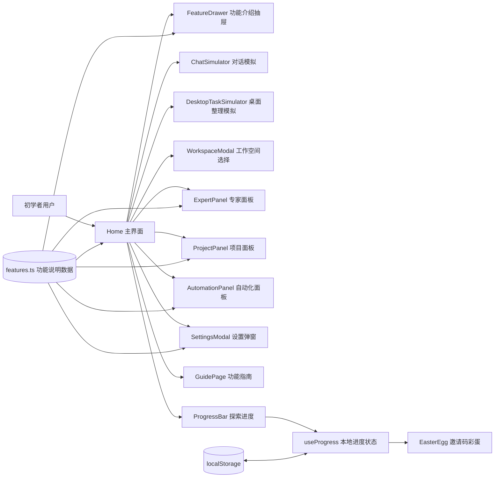
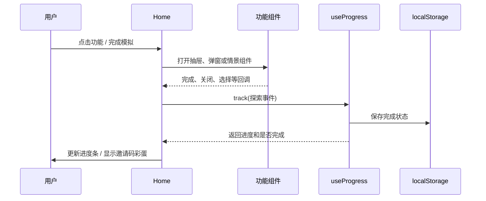

# 项目结构地图

## 总体架构



该网页是以 React 为核心的静态前端项目。主要数据流在浏览器内闭环：`Home` 维护当前视图和模拟状态，功能模块展示预设内容，`useProgress` 将探索进度写入 `localStorage`。在当前源码快照中，不存在数据库、账号认证或对外 API 调用。[1] [2]

## 源码目录树

```text
source-code/
├── client/
│   ├── index.html                       # 页面入口、字体与元信息
│   └── src/
│       ├── App.tsx                      # 路由、主题、Toast 与全局容器
│       ├── index.css                    # 全局 token、主题、交互与动效样式
│       ├── pages/
│       │   ├── Home.tsx                 # 主界面与主要交互编排
│       │   └── NotFound.tsx
│       ├── components/
│       │   ├── FeatureDrawer.tsx        # 右侧功能解释抽屉
│       │   ├── ChatSimulator.tsx        # 对话情景模拟
│       │   ├── DesktopTaskSimulator.tsx # 桌面整理任务模拟
│       │   ├── WorkspaceModal.tsx       # 工作空间选择模拟
│       │   ├── SettingsModal.tsx        # 设置、教学卡片与 Tooltip
│       │   ├── GuidePage.tsx            # 飞书/PDF 内容导览
│       │   ├── ExpertPanel.tsx          # 专家视图
│       │   ├── ProjectPanel.tsx         # 项目视图
│       │   ├── AutomationPanel.tsx      # 自动化视图
│       │   ├── ProgressBar.tsx          # 探索进度组件
│       │   ├── EasterEgg.tsx            # 邀请码彩蛋组件
│       │   └── ui/                      # shadcn/ui 基础组件
│       ├── data/features.ts             # 功能说明数据与面板素材数据
│       ├── hooks/useProgress.ts         # 探索进度状态与 localStorage 持久化
│       ├── contexts/ThemeContext.tsx    # 主题上下文
│       └── lib/utils.ts                 # 工具函数
├── server/index.ts                      # 生产环境静态文件服务
├── shared/const.ts                      # 共享常量占位
├── package.json                         # 脚本与依赖
├── vite.config.ts                       # Vite 配置
└── tsconfig*.json                       # TypeScript 配置
```

## 页面、模块与职责

| 模块 | 输入 | 输出 / 交互 | 主要依赖 |
|---|---|---|---|
| `Home.tsx` | 当前视图、用户点击、功能数据 | 组织主界面及所有模拟入口 | React、features、各功能组件、useProgress |
| `FeatureDrawer.tsx` | 功能定义对象、关闭事件 | 从右侧滑入的功能说明 | features 数据、CSS transition |
| `ChatSimulator.tsx` | 预设问题或自由输入 | 模拟流式消息、Markdown、术语解释 | React state、预设内容 |
| `DesktopTaskSimulator.tsx` | 运行事件 | 8 步任务流程与结果报告 | React timer/state |
| `WorkspaceModal.tsx` | 搜索、选择事件 | 目录列表、收藏与确认状态 | React state |
| `SettingsModal.tsx` | activeTab、设置交互 | 子页、自动教学卡片、fixed Tooltip | React state、Lucide 图标 |
| `GuidePage.tsx` | Tab、章节导航 | 长页教程与名词说明 | 内置文档数据、CSS |
| `useProgress.ts` | 9 类 track 事件 | 进度对象、彩蛋触发状态 | localStorage |
| `EasterEgg.tsx` | 完成状态、邀请码 | 粒子风格彩蛋弹窗和复制行为 | Clipboard API（浏览器） |

## 数据流说明



## 接口与依赖边界

| 类别 | 当前状态 | 说明 |
|---|---|---|
| 前端框架 | React 19 | 通过 Vite 提供开发与构建。 |
| 样式 | Tailwind CSS 4 + 项目 CSS | 主题 token 位于 `client/src/index.css`。 |
| UI 基础组件 | shadcn/ui + Radix | 位于 `client/src/components/ui/`。 |
| 图标 | lucide-react | 用于导航、设置、功能标识。 |
| 路由 | Wouter | `App.tsx` 中配置首页和 404。 |
| 数据库 / API | 无 | 本项目为静态前端演示。 |
| 模型 API | 无真实调用 | 模型设置仅模拟界面和教学内容。 |
| 本地持久化 | localStorage | 保存探索彩蛋进度。 |

## 构建与运行

| 命令 | 作用 | 本次验证 |
|---|---|---|
| `pnpm run dev` | 启动本地 Vite 开发服务器 | 未在本资料包阶段重新启动；已有运行日志快照。 |
| `pnpm run check` | TypeScript 类型检查 | 本次实际执行并通过。 |
| `pnpm run build` | Vite 前端构建 + esbuild 服务端打包 | 本次实际执行并通过；存在 chunk 体积提示。 |

## References

[1]: [package.json](source-code/package.json)
[2]: [构建与类型检查记录](source/test-records/build-and-typecheck.md)
[3]: [Git 版本历史](source/version-history/git-history.txt)
[4]: [设计思路与信息架构](02_设计思路与信息架构.md)

