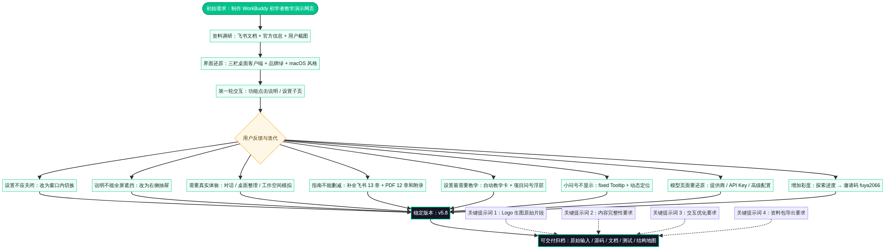

# 迭代过程与重点提示词复盘图

本图以“用户反馈驱动的设计收敛”为主线，归纳本任务从第一版界面到最终可交付资料包的关键节点。可编辑 Mermaid 源码见 [迭代复盘图源文件](diagrams/workbuddy_迭代复盘与提示词地图.mmd)；渲染 PNG 将在 `diagrams/` 中提供。

## 迭代阶段总览

| 阶段 | 用户核心诉求 | 实施结果 | 对最终产品的影响 |
|---|---|---|---|
| 需求建立 | 制作“假的 WorkBuddy 网页”，以功能介绍服务初学者 | 建立高保真三栏桌面客户端演示站 | 确定“真实感 + 教学”双目标。 |
| 基础还原 | 参考截图和飞书文档 | 完成主界面、导航、专家、项目、自动化、设置 | 形成可点击的初始产品骨架。 |
| 交互纠偏 | 设置切换不应关闭页面 | 设置改为窗口内子页切换 | 改善与真实软件一致性。 |
| 低遮挡教学 | 解释弹出不应遮挡全屏 | 功能介绍改为右侧抽屉 | 实现“边看界面边看说明”。 |
| 真实任务体验 | 需要模拟对话、桌面整理与工作空间选择 | 新增三个情景模拟组件 | 从静态导览升级为可操作演示。 |
| 内容完整性 | PDF / 飞书内容不能大量丢失 | 补齐飞书 13 章、PDF 12 章和附录 | 功能指南从摘要转向可学习资料。 |
| 设置教学 | 设置页是最需要教学的区域 | 自动教学卡 + 问号浮层双层机制 | 将全局概念与细项解释分离。 |
| 交互稳定性 | 小问号打不开 | fixed Tooltip + 动态定位 | 解决 overflow 裁剪问题。 |
| 配置还原 | 模型页面需按真实截图补充 | 添加模型窗、提供商、API Key、高级配置 | 提高模型教学的真实性。 |
| 激励机制 | 完成案例、解释、教程后出现邀请码 | 9 类探索进度 + `fuya2066` 彩蛋 | 鼓励完整体验教程。 |
| 交付治理 | 图片、Skill、设计文档、聊天过程要导出 | 静态素材、Skill、提示词与设计资料归档 | 提升后续移交和复用能力。 |

## 重点提示词与指令溯源

以下条目按“可验证原文 / 摘要 / 缺失说明”区分。除 Logo 生图片段外，其他均为本任务用户提出的关键交付或体验指令，不属于模型生成提示词。

| 编号 | 类型 | 记录 | 影响 | 原始性状态 |
|---|---|---|---|---|
| P-01 | 生图提示词 | `A cute robot cat mascot icon for WorkBuddy AI assi` | 生成 WorkBuddy 机器猫 Logo。 | **仅保留截断原始片段**。 |
| P-02 | 体验指令 | “交互都和正常网站一样，只是会跳出对应功能介绍。” | 确定可点击功能区和解释机制。 | 可读版聊天过程已保留。 |
| P-03 | 体验指令 | “不要弹出解释后就遮挡了全屏，交互优化。” | 功能解释由居中弹窗改为右侧 Drawer。 | 可读版聊天过程已保留。 |
| P-04 | 内容指令 | “功能指南不能删改，我看你少了很多内容。” | 对飞书和 PDF 内容采取补全而非摘要化策略。 | 可读版聊天过程已保留。 |
| P-05 | 教学指令 | “设置里的教学内容怎么没有，这里最需要教学了。” | 增加设置页教学机制。 | 可读版聊天过程已保留。 |
| P-06 | 教学交互指令 | “解释放到外面悬浮好吧。” | 细项说明改为外置 Tooltip。 | 可读版聊天过程已保留。 |
| P-07 | 质量修复指令 | “小问号打不开。” | 固定定位 Tooltip，规避父容器裁剪。 | 可读版聊天过程已保留。 |
| P-08 | 彩蛋指令 | “全部激活跳出一个邀请码 fuya2066。” | 加入探索进度和彩蛋机制。 | 可读版聊天过程已保留。 |
| P-09 | 交付指令 | 本次“收尾整理与可交付导出”要求 | 建立当前完整资料包。 | 当前用户请求。 |

## 复盘结论

本任务的主要价值来自持续把抽象功能说明转为“用户可以立即操作的学习场景”。最关键的设计收敛并不是视觉装饰，而是对三类反馈的响应：**内容不能丢失、教学不能打断操作、配置页面需要真实可理解**。最终产品通过抽屉、浮层、自动教学卡、情景模拟和可追踪彩蛋，将这三类要求组合为一套完整体验。[1] [2]

## References

[1]: [可读版聊天过程归档](source/core-knowledge/workbuddy-chat-process.md)
[2]: [设计思路与信息架构](02_设计思路与信息架构.md)
[3]: [提示词原始记录与可复现性说明](source/core-knowledge/prompt-provenance.md)
[4]: [Git 版本历史](source/version-history/git-history.txt)
